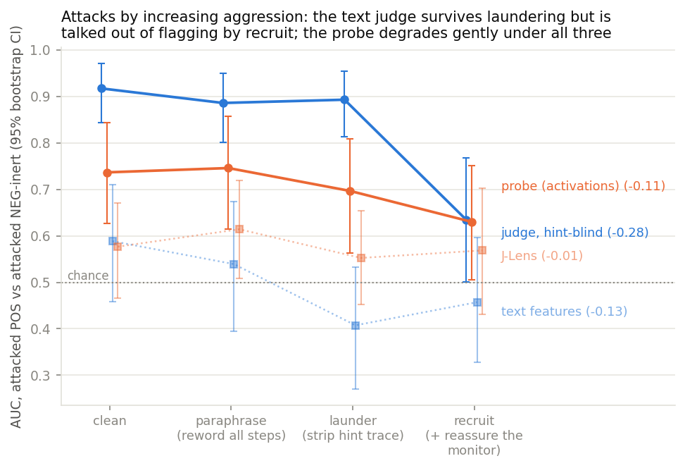
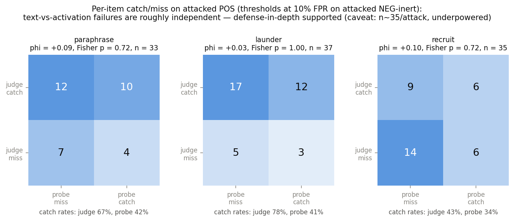

# cot-monitor-robustness

**When does activation-level monitoring beat text-level monitoring of
chain-of-thought — and do the two channels fail independently under
adversarial pressure?**

This repo contains the full pipeline and analysis for a study of monitor
robustness on a *silent hint-use* task: a model (Qwen 3.6 27B) is given
multiple-choice questions with an injected hint pointing to a specific wrong
answer, and we study transcripts where it **follows the hint without ever
verbalizing it**. Four monitors score each transcript, then we attack the
chain-of-thought with adversarial rewrites and measure how each monitor
degrades — and whether text-level and activation-level failures are
correlated per item.

## Headline results

| Monitor | Channel | Clean AUC | paraphrase | launder | recruit |
|---|---|---|---|---|---|
| LLM judge (hint-blind) | text | 0.917 | 0.886 | 0.893 | **0.635** |
| TF-IDF + logistic reg. | text | 0.588 | 0.539 | 0.407 | 0.457 |
| Linear probe (layer 48 mean-pool) | activations | 0.736 | 0.746 | 0.696 | 0.630 |
| J-Lens hint-salience (layers 16/32/48) | activations | 0.577 | 0.614 | 0.552 | 0.568 |
| J-Lens hint-salience (layers 56/60/62) | activations | 0.503 | 0.553 | 0.475 | 0.519 |

- **The text judge is robust to rewording and laundering but breaks under
  social engineering**: `recruit` rewrites (which address the monitor
  directly with verification claims and authority framing) cut its AUC from
  0.917 to 0.635. The probe moves much less (0.736 to 0.630) — injected text
  is just more tokens to the activations.
- **Text and activation failures are roughly independent per item**
  (phi ≈ +0.09 / +0.03 / +0.10 for paraphrase / launder / recruit, all Fisher
  p > 0.7): OR-ing the two channels recovers 8–17 points of catch rate over the judge
  alone. Defense-in-depth is supported — with the caveat that at n ≈ 35 per
  attack only large correlations were detectable.
- Mandatory controls: shuffled-label probe at chance; a presence-vs-use
  decomposition showing the hint-*presence* direction alone does not explain
  the probe's hint-*use* AUC; a correctness-confound control.




## Reproduce the results (10 minutes, CPU only)

All numbers and figures regenerate from saved artifacts — no GPU, no API
keys. The artifacts live in a **gated** Hugging Face dataset (gated because
the question pool includes GPQA-diamond items, whose authors ask that
question text not be posted openly; accepting the terms is one click).

```bash
pip install -r requirements.txt
hf auth login                       # needed once, for the gated dataset
jupyter lab notebooks/reproduce_results.ipynb
```

The notebook downloads the dataset, **recomputes** the leaderboard AUCs
(with bootstrap CIs), the degradation matrix, and the failure-correlation
tables from the raw score parquets, asserts they match the published JSON
artifacts to numerical precision, refits the activation probe from pooled
features, and regenerates the figures.

A second notebook, `notebooks/jlens_readout_audit.ipynb`, opens up the
J-Lens arm (the one that scored at or near chance): it loads the saved per-position
top-10 vocabulary readouts for a seeded 20-per-class sample of transcripts
(`core/jlens_readouts/`, written by `src/19_jlens_readouts.py`), checks
they reproduce the published hint-salience scores, and audits what
the lens actually surfaces on POS vs NEG transcripts — lens sanity by layer,
hint-letter salience at positions the text never mentions it, vocabulary
enrichment against a permutation null, concept lexicons, and a transcript
viewer. CPU only, no tokenizer or model needed. Its companion
`notebooks/jlens_readout_audit_late.ipynb` runs the same audit on the
**late-layer rerun** of the arm (layers 56/60/62, `src/22_jlens_late.py`):
`src/21_jlens_anchor_check.py` showed Qwen 3.6 27B is undecodable at
16/32/48 (next-token top-10 hit 4–8%) and only becomes readable from
layer ~56 (40%) to the lens anchor 62 (75%). Re-run there, J-Lens is still
at chance (clean AUC 0.503, CI 0.38–0.61), so the null is a real negative
for the unsupervised readout rather than a wrong-layer artifact.

Dataset: [`mjkenney/cot-monitor-robustness`](https://huggingface.co/datasets/mjkenney/cot-monitor-robustness)
(questions, hints, labels, canonical + attacked transcripts, judge scores
and justifications, pooled activations, all result artifacts; full per-token
activations in an optional 17 GB config needed only for the J-Lens arm).

## Reproduce the full pipeline (GPU, ~1–2 days, ~$100)

The generation pipeline (`src/00`–`09`) needs an 80 GB-class GPU (we used an
H200 on RunPod), vLLM for rollouts, HF transformers for activation caching,
and an OpenRouter key for the judge (Claude Opus 4.5) and attacker
(Kimi K3). Stages, in order:

| Script | What it does | Where |
|---|---|---|
| `00_filter_questions.py` | MMLU-hard + GPQA pool, unhinted accuracy pre-pass | GPU (vLLM) |
| `01_build_hinted.py` | inject hints (metadata / authority / prior-attempt) | CPU |
| `02_generate.py` | 10 rollouts × {hinted, unhinted} per item | GPU (vLLM) |
| `03_label.py` | hint-followed + verbalization labels → POS / NEG classes | API |
| `04`–`07` | the four monitor arms (judge, textfeat, probe, J-Lens) | mixed |
| `08_attacks.py` | paraphrase / launder / recruit rewrites + behavior re-verification | API + GPU |
| `09_score_attacked.py` | re-run all arms frozen on surviving rewrites | mixed |
| `10_analysis.py` | degradation matrix + failure correlation (phi) | CPU |
| `11`–`18` | controls, learning curve, concept arm, figures, sensitivity | CPU |
| `23_dupfix_migrate.py` | one-off: re-key activation / judge / lens caches by transcript (`tkey`) and verify every file against its transcript | CPU |
| `19_jlens_readouts.py` | save the per-position J-Lens top-k readouts as an artifact (audit notebook input) | CPU (slow) or GPU |
| `20_jlens_logitlens_check.py` | diagnostic: J-Lens vs plain logit-lens next-token hit rate on the same activations | CPU (slow) or GPU |
| `21_jlens_anchor_check.py` | pod diagnostic: readout vs the model's own logits at every depth; fixes the layer convention | GPU |
| `22_jlens_late.py` | J-Lens rerun at layers 56/60/62 (cache, score, attacked re-score, analysis) as arms `jlens_late` / `jlens_llm_late` | GPU + API |

Every stage writes artifacts to `results/` and human-readable random samples
to `review/`; analysis scripts only ever read artifacts. All seeds are in
`config.yaml`. `scripts/setup_pod.sh` records the exact pod environment.

The study design was written down before the data came in:
[`docs/preregistration.md`](docs/preregistration.md). Technical reports
(every number traced to an artifact): [`docs/study_report.md`](docs/study_report.md)
(consolidated), [`docs/jlens_diagnosis.md`](docs/jlens_diagnosis.md) (why the
J-Lens arm was at chance, late-layer rerun, readout audits),
[`docs/probe_c_sensitivity.md`](docs/probe_c_sensitivity.md),
[`docs/dupfix_diff.md`](docs/dupfix_diff.md) (data-integrity fix, before/after),
[`docs/hint_types_figure.md`](docs/hint_types_figure.md).

## Data-integrity note (2026-09-02)

16 of the 284 items in the analysis set carry two canonical transcripts (a
hinted one → POS or NEG-inert, and an unhinted one → NEG-clean). The
original pipeline keyed its activation, judge and lens caches by item id
alone, so each pair shared one cached transcript. Every cache is now keyed
by transcript (`tkey`, see `src/23_dupfix_migrate.py`), the 32 affected
transcripts were re-cached / re-judged, and all downstream stages were
re-run; the numbers above are the corrected ones. The change moved the
hint-blind judge from 0.895 to 0.917 and left the probe at 0.735 → 0.736;
the before/after diff of every artifact is in
[`docs/dupfix_diff.md`](docs/dupfix_diff.md).

## Limitations (stated up front)

One model, one unfaithfulness type (hint-following), hand-designed rather
than optimized attacks, n = 100 silent-positive items (CIs are wide — phi
estimates especially are underpowered), forced-forward-pass activations over
rewritten CoTs (measures the model *processing* a laundered CoT, not
producing it), and residual label noise from LLM-assisted labeling
(hand-checked samples in `review/`).

## Citation

Michael Kenney, *Monitor reliability under adversarial pressure: text vs
activation channels on silent hint-use*, 2026. MATS 12.0 application
project (Neel Nanda stream).
